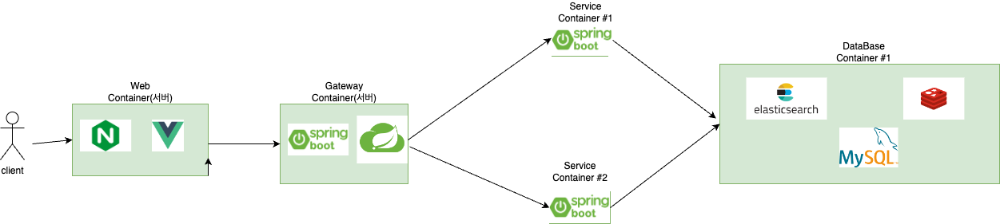
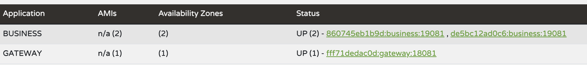

# docker-infra-study

## 개요

2024년 5월에 시작한 스터디개념

## 최종 목표

- 개인마다 다르나 필자의 경우는 docker, k8s를 가상의 인프라에 적용

- 가상의 인프라는 팀에서 구성하고 있는 인프라를 축소한 개념으로 향후 서비스들을 쿠버네티스로 관리할 예정이라 미리 학습 필요.

- k8s에 대해서는 다뤄보고 싶었음

## 가상 인프라 구조

- ubuntu 22.04 이미지로 컨테이너를 띄움. 
- client Container: nginx + vue와 같은 ui적 요소를 담고 있는 가벼운 컨테이너이자 서버
- gateway Container: gateway역할과 `Spring Cloud Netiflix`를 가지고 있는 서버 
- business Container1: 비즈니스 로직을 처리하는 서버. `Spring Cloud Netflix`에 서비스를 연결
- business Container2: business Container1을 duplicate한 서버. 이중화 구조를 만들기 위함.
- DB Container1: `Elastic Search`, `Redis`, `MySQL`, 등 데이터들을 관리하는 서버

### 기록

#### 1주차
- 목표: Container 3개 구성(client, gateway, db)
  - docker-compose와 docker의 기능을 최대한 절제하며 구성
  - `shell`디렉터리에 관련 쉘 스크립트 정리
  - `checkServer.sh`로 서버 상태를 확인할수록 구성, 단점으로 running 상태의 컨테이너만 확인이 가능
  - client Container는 cpu1개 지정, memory는 최대 1G까지 사용가능
  - gateway Container는 cpu2개 지정, memory는 최대 2G까지 사용가능
  - DB Container는 cpu2개 지정, memory는 최대 4G까지 사용가능

#### 2주차
- 목표: client Container에 nginx + client code 삽입, 컨테이너가 생성되면 nginx, java 자동설치 nginx 실행까지
  1. docker 기능을 최대한 사용하지 않아보기로함.
  2. shell script 하나로 nginx download, 실행, 컨테이너 디렉터리 생성 등을 만들어놓음
  3. 단점으로, 디버그가 어렵다. 만약 중간에 문제가 생기면 첫 줄부터 다시 실행해야되기에 비효율적임을 느낌 => docker build가 좋은 이유를 깨달음.
  4. 만들어놓은 shell script로 `enrtypoint` 옵션을 통해 docker container생성시 해당 스크립트를 실행하도록 함.
  5. 관련 스크립트 : `proxy-init-script.sh`
  6. 위 스크립트를 Dockerfile로 재작성 명령어가 대부분 1:1매칭이 됨.
  7. 관련 파일: `./front/Dockerfile` 
  8. `vue`는 helloworld수준의 페이지만 보여주도록 함.
  9. docker의 `multiStage`기능을 통하여 빌드만 하고 assets파일들을 nginx 서버 컨테이너에 옮기고 실행 확인

#### 3주차

- 목표: gateway, business 서버 분리 / eureka 적용 / 각 서비스 통신 확인
  1. 로컬에서 프로젝트를 생성하여 테스트
  2. 기존 server컨테이너 1개를 두개로 분리할 필요를 느껴 컨테이너 1개 더 생성(현재 총 4개)
  3. `docker network`를 통해서 도커 컨테이너끼리 서로 통신함을 확인
  4. Dockerfile을 통해서 빌드된 .jar파일을 컨테이너 실행시 자동으로 실행하도록 설정
  5. 관련 파일: ./shell/server-docker/business & ./shell/server-docker/gateway

#### 4주차

- 목표: jenkins구축 / business 서버 이중화 구성 / DB 컨테이너 구성(es, redis, 등)
  1. (gateway-eureka)/business 를 docker-compose로 구성(cpu, memory제한 추가)
  2. business 컨테이너 2중화 구조 및 통신 확인 => 라운드로빈 형식으로 호출됨
  
